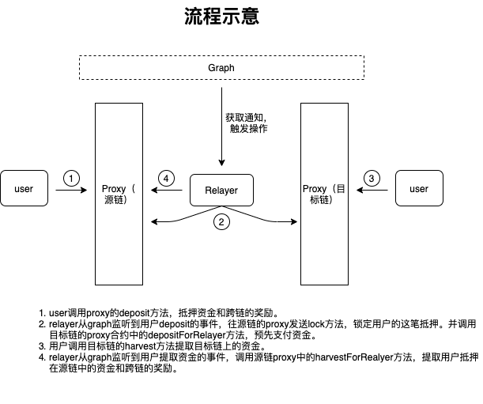
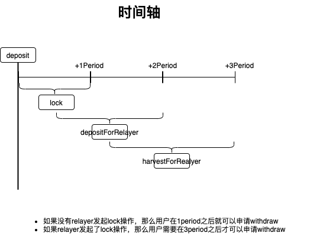

# 跨链代理合约
## 安装与测试（可参照truffle命令）
### 安装
`npm install`
### 编译
`truffle compile`
### 发布
`truffle migrate --network {network}`
### 测试
`truffle test ./test/1.proxy.test.js  --network {network}`

## 逻辑简述
整个跨链系统中，有四个角色。用户，代理，中继器，触发器。本合约实现的代理逻辑。主要的功能是寄存用户和中继器的资产，实现两个不同链之间的资产置换。   
用户质押资产在源链上，中继器监控到质押事件之后将等比例的目标链资产也质押在目标链上。此时，资产全部都在两端的代理合约中。    
用户将提取源链资产的签名数据提交给目标链的代理合约并提取目标链中的资产。此时，目标链的资产已经被提取，源链的资产还未释放。    
中继器利用用户提交的签名数据从源链中提取资产。此时，代理合约中已经没有钱。

## 接口简述
[接口文档](./doc/api.md)

## 流程图

## 时间轴
